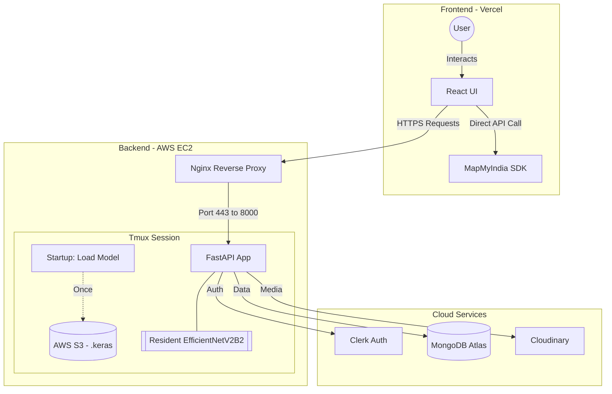

# 🐾 Pawdentify – AI Breed Classifier & Pet Management Platform

**Pawdentify** is a production-grade full-stack platform that identifies 120+ dog breeds with **89% accuracy** and offers a comprehensive suite for pet health management. It bridges the gap between Deep Learning and user-centric design, providing a localized experience in 4 languages.

---

## 🔗 Live Deployment
* **Production Frontend:** [https://pawdentify-frontend.vercel.app](https://pawdentify-frontend.vercel.app)
* **Production API:** [https://pawdentify-backend.duckdns.org](https://pawdentify-backend.duckdns.org)
* **Interactive API Docs:** [https://pawdentify-backend.duckdns.org/docs](https://pawdentify-backend.duckdns.org/docs)

---

## 🏗️ System Architecture

## 🌟 Features & Highlights

### **AI-Powered Identification**
* **EfficientNetV2B2 Backbone:** Utilizes a state-of-the-art **EfficientNetV2B2** architecture for high-precision breed classification (Inference time < 3s).
* **Deep Breed Insights:** Access comprehensive data on temperament, physical traits, and care requirements for 120+ breeds.

### **Pet Management System**
* **Digital Pet Profiles:** Add and manage multiple pets with customized profiles.
* **Health & Activity Tracking:** Add persistent notes with categorized tags:
    * 💉 **Vaccination:** Track immunization dates and history.
    * 🥗 **Nutrition:** Log food preferences and dietary requirements.
    * 💊 **Medical:** Keep records of medications and vet visits.
    * 🎾 **Activity:** Monitor exercise and training progress.

### **Localized Experience**
* **Multilingual Support:** Fully localized UI in **English, Hindi, Urdu, and French** via `i18next`.
* **Veterinary Locator:** Real-time clinic discovery integrated with **MapMyIndia SDK**.

---

## 🏗️ Engineering & DevOps
* **Model Decoupling:** The `.keras` model is decoupled from the application logic, hosted on **AWS S3**, and fetched dynamically via `boto3` on server initialization.
* **Production Networking:** Secured via **Let's Encrypt (SSL)** and managed with an **Nginx** reverse proxy on an **AWS EC2** Ubuntu instance.
* **Identity Management:** Secure user authentication and dashboard synchronization provided by **Clerk**.

---

## 📸 UI & Features Gallery

| **Home & Landing** | **AI Breed Prediction** |
| :---: | :---: |
|  |  |
| **Breed Identification Results** | **Detailed Breed Insights** |
|  |  |
| **Veterinary Locator (Map)** | **Breed Search & Ranking** |
|  |  |
| **Pet Profiles & Management** | **Health Tracking & Notes** |
|  |  |

---

## 🛠️ Technology Stack

**Frontend:** React 18, Vite, Tailwind CSS, Framer Motion, i18next (Localization).  
**Backend:** FastAPI (Python 3.10), TensorFlow, Cloudinary (Image Hosting), MongoDB.  
**Infrastructure:** AWS (EC2, S3, IAM), Vercel, Nginx, Certbot (SSL), DuckDNS.

---

## 🚀 Engineering Challenges & Solutions

* **Model Optimization:** Transitioned from EfficientNetB0 to **EfficientNetV2B2**, achieving a better balance between accuracy (89%) and inference speed for real-time mobile usage.
* **Cold Start Latency:** Implemented an asynchronous model-loading strategy from **AWS S3** on startup to ensure the API is ready for requests immediately upon container health checks.
* **Secure Multi-Tenancy:** Leveraged **Clerk JWTs** to scope MongoDB queries, ensuring that pet health notes and history remain private to the authenticated owner.
* **Infrastructure as Code:** Documented the full deployment pipeline from **GitHub Actions** to **AWS EC2**, utilizing **Nginx** for request buffering and SSL termination.

---

## 📊 Project Statistics
* **Dataset:** Stanford Dogs (20,000+ images)
* **Model Backbone:** EfficientNetV2B2 (Transfer Learning)
* **Top-1 Accuracy:** 89%
* **Average API Latency:** 2.4s
* **Localization:** 4 Languages (i18next)

---

## 🛠️ Minimalist Setup (For Development)
Since this project relies on specific Cloud Infrastructure (AWS, Clerk, MapMyIndia), it is optimized for production. To run a local instance:

1. Clone the repo.
2. Provide your own `.env` file based on the keys listed in the **Deployment Documentation**.
3. Run the backend via `uvicorn` and frontend via `npm run dev`.

*Note: For a full walkthrough of the infrastructure setup, please see the Pawdentify – Deployment & Infrastructure Documentation.pdf in the root directory.*

---

Built with ❤️ by [Devashish Mishra](https://github.com/Devashish-Mishra)
